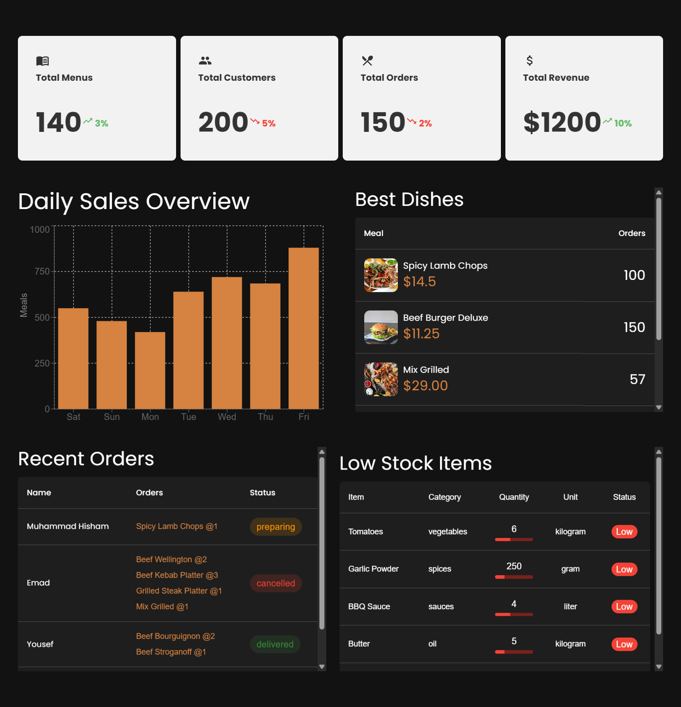

<p align="center">
  
</p>

# Butcha Restaurant Dashboard


A comprehensive restaurant management system designed specifically for meat-focused dining establishments with real-time dashboard, order management, and analytics.

## Features

- 🔒 **Secure Authentication** using Firebase Auth with role-based access
- 🔒 **Secure Routes** secure specified routes if visitor did not login
- 🍖 **Meals Management** complete CRUD operations for meat dishes (add, update, delete)
- 📋 **Reservations Management** table booking system with CRUD operations (add, update, delete, view)
- 📊 **Orders Management** comprehensive order handling (create, update, cancel, track status)
- 📈 **Analytics Dashboard** with sales reports and charts using Recharts
- 🔄 **Real-time Updates** with Firestore and TanStack Query
- 📱 **Responsive Design** works perfectly on all devices
- 🏷️ **Meta Tags Control** dynamic website title changes when navigating between pages

## Pages & Components

| Page/Component | Description |
|---------------|-------------|
| **Home Page** | Landing page with restaurant overview and featured meals |
| **About Page** | Restaurant story, mission, and team information |
| **Contact Page** | Contact information, location map, and inquiry form |
| **FAQ Page** | Frequently asked questions and customer support |
| **Menu Page** | Complete meat dishes catalog with categories and pricing |
| **Dashboard** | Admin/staff panel for restaurant management and analytics |
| **Login Page** | Secure authentication for customers and staff |
| **Register Page** | New user registration with email/password validation |
| **Customer Data Form** | Customer profile management and personal information |
| **Reservation Page** | Table booking system with date/time selection |
| **Cart Page** | Order summary, item management, and checkout process |
| **Not Found (404)** | Custom error page for invalid routes |

## Tech Stack

**Frontend:**

- React.js 18+
- Vite (Build tool)
- Material-UI (MUI) v5
- TanStack Query (v4+)
- React Router v6
- React Hook Form
- Zustand (State Management)
- Recharts (Analytics)

**Backend Services:**

- Firebase Authentication
- Firestore Database
- Firebase Storage

**UI & Styling:**

- Material-UI Components
- MUI Icons
- Responsive Grid System

## Screenshots




## 🚀 Live Preview

Check out the live version here: [Meat Meals Dashboard](https://your-deployment-url.vercel.app/)

## 📂 Folder Structure

```
meat-meals-dashboard/
├── public/
│   ├── favicon.ico
│   └── index.html
├── src/
│   ├── assets/
│   │   ├── images/
│   │   └── icons/
│   ├── components/
│   │   ├── common/
│   │   ├── forms/
│   │   ├── modals/
│   │   └── charts/
│   ├── hooks/
│   │   ├── useAuth.js
│   │   ├── useOrders.js
│   │   └── useMenu.js
│   ├── pages/
│   │   ├── Dashboard/
│   │   ├── Orders/
│   │   ├── Menu/
│   │   ├── Inventory/
│   │   ├── Staff/
│   │   └── Auth/
│   ├── services/
│   │   ├── firebase.js
│   │   ├── auth.js
│   │   └── firestore.js
│   ├── stores/
│   │   ├── authStore.js
│   │   ├── orderStore.js
│   │   └── menuStore.js
│   ├── utils/
│   │   ├── constants.js
│   │   ├── helpers.js
│   │   └── formatters.js
│   ├── App.jsx
│   ├── main.jsx
│   └── index.css
├── package.json
├── vite.config.js
├── eslint.config.js
└── README.md
```

## Installation

1. Clone the repository:

```bash
git clone https://github.com/your-username/meat-meals-dashboard
cd meat-meals-dashboard
```

2. Install dependencies:

```bash
npm install
# or
yarn install
```

3. Start the development server:

```bash
npm run dev
# or
yarn dev
```

## 🔥 Firebase Configuration

### 1. Firebase Project Setup

1. Go to [Firebase Console](https://console.firebase.google.com/)
2. Click "Add Project" and follow the setup wizard
3. Enable these services:

### 2. Authentication Setup

```bash
# Enable Email/Password and Google auth:
1. Go to Authentication → Sign-in method
2. Click "Email/Password" and enable it
3. Click "Google" and enable it (optional)
4. Save changes
```

### 3. Firestore Database Setup

1. Go to Firestore Database
2. Click "Create Database" → Start in test mode
3. Choose your preferred region
4. Create these collections:
   - `restaurants`
   - `orders`
   - `menuItems`
   - `inventory`
   - `users`
   - `staff`

### 4. Firebase Storage Setup

1. Go to Storage
2. Click "Get Started"
3. Set up security rules for image uploads

### Environment Variables

Create `.env.local` file in project root:

```env
VITE_FIREBASE_API_KEY=your_api_key_here
VITE_FIREBASE_AUTH_DOMAIN=your_project.firebaseapp.com
VITE_FIREBASE_PROJECT_ID=your_project_id
VITE_FIREBASE_STORAGE_BUCKET=your_project.appspot.com
VITE_FIREBASE_MESSAGING_SENDER_ID=your_sender_id
VITE_FIREBASE_APP_ID=your_app_id
```

## 🏗️ Build for Production

```bash
# Build the application
npm run build

# Preview the build
npm run preview

# Deploy to Firebase Hosting (optional)
npm install -g firebase-tools
firebase login
firebase init hosting
firebase deploy
```

## 📊 Key Features Details

### Order Management

- Real-time order tracking from kitchen to delivery
- Order status updates (pending → preparing → ready → delivered)
- Kitchen display system integration
- Customer notification system

### Analytics Dashboard

- Daily/weekly/monthly sales reports
- Popular menu items analysis
- Staff performance metrics
- Inventory turnover rates
- Customer behavior insights

### Inventory Management

- Real-time stock tracking
- Expiration date monitoring
- Automatic reorder alerts
- Supplier management
- Cost analysis and profitability reports

## 🔐 User Roles

| Role | Permissions |
|------|-------------|
| **Admin** | Full system access, analytics, staff management |
| **Manager** | Order management, inventory, reports |
| **Staff** | Order taking, status updates |
| **Kitchen** | Order preparation, inventory updates |

## 👨‍💻 Author

[](https://www.linkedin.com/in/your-profile/)
[](mailto:your.email@gmail.com)

## 📄 License

This project is licensed under the MIT License - see the [LICENSE](LICENSE) file for details.

## 🤝 Contributing

1. Fork the project
2. Create your feature branch (`git checkout -b feature/AmazingFeature`)
3. Commit your changes (`git commit -m 'Add some AmazingFeature'`)
4. Push to the branch (`git push origin feature/AmazingFeature`)
5. Open a Pull Request

## ⭐ Show your support

Give a ⭐️ if this project helped you!
